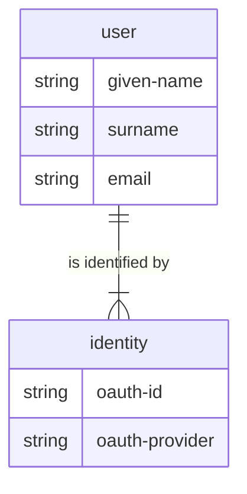

# multi-money

[](https://github.com/dgknght/multi-money/actions/workflows/clojure.yml)

Double-entry accounting system written in Clojure and designed to
use multiple back-end storage strategies.

## Overview

This project is a combination of my desire to have a cloud-based,
easy-to-use accounting tool, and a vehicle with which I test programming
tools and strategies.

### Models

## Setup

### OAuth

#### Google
Set the following environment variables
- GOOGLE_OAUTH_CLIENT_ID
- GOOGLE_OAUTH_CLIENT_SECRET

### Create the databases

#### SQL
```bash
lein migrate && lein with-profile +test migrate
```

## Development
### Back end
#### SQL
Create and initialize the postgresql database.
1. [Install docker-compose](https://docs.docker.com/compose/install/standalone/).
2. Start docker compose with `docker-compose -f dev-compose.yml up -d`.
3. Create the development database:
```bash
psql --username=app_user --host=localhost -W --command="CREATE DATABASE multi_money_development;"
```
4. Create the test database:
```bash
psql --username=app_user --host=localhost -W --command="CREATE DATABASE multi_money_test;"
```
5. Migrate the databases:
```bash
lein migrate && lein with-profile +test migrate
```

### Test the server
```bash
lein test
```

### Front End
To get an interactive development environment run:
```bash
lein fig:build
```

This will auto compile and send all changes to the browser without the
need to reload. After the compilation process is complete, you will
get a Browser Connected REPL. An easy way to try it is:
```bash
(js/alert "Am I connected?")
```

and you should see an alert in the browser window.

To clean all compiled files:
```bash
lein clean
```

To create a production build run:
```bash
lein do clean, fig:min
```

## License

Copyright © 2018 FIXME

Distributed under the Eclipse Public License either version 1.0 or (at your option) any later version.
