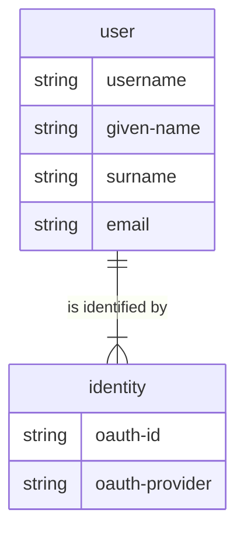

# multi-money

Double-entry accounting system written in Clojure and designed to
use multiple back-end storage strategies.

## Overview

This project is a combination of my desire to have a cloud-based,
easy-to-use accounting tool, and a vehicle with which I test programming
tools and strategies.

### Models

## Development

To get an interactive development environment run:

    lein fig:build

This will auto compile and send all changes to the browser without the
need to reload. After the compilation process is complete, you will
get a Browser Connected REPL. An easy way to try it is:

    (js/alert "Am I connected?")

and you should see an alert in the browser window.

To clean all compiled files:

	lein clean

To create a production build run:

	lein clean
	lein fig:min

## License

Copyright © 2018 FIXME

Distributed under the Eclipse Public License either version 1.0 or (at your option) any later version.
